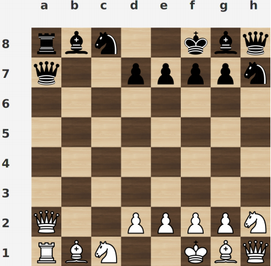

# GenericChessGame

This chess game application differs from the traditional chess game because the user defines the movements of each piece as he pleases. That is why it is called generic. For instance, a bishop can move like a queen or new movements that do not exist in the normal game can be added. It must be configurated in the json file, which provides information about:

* Board size
* Pieces
  * name
  * symbol
  * images (white and black)
  * movements
  * initial movements
  * promotion 
  * invulnerability
* Initial position of each piece
* Limit of checks
* Limit of inactive turns
* Castling, that can happen between any two pieces, not only king and rook

It includes a terminal mode and a graphic interface, with also the possibility of playing with an AI or having two AIs playing against each other. 

The program detects check, checkmate and draw. The player can request stalemate. Moreover, it lets undo and redo as many movements as possible.

The game can be stopped and saved so the players can continue with it at anytime. It is saved in a json file in the same directory. Whenever the game finishes, the whole game is saved as well in a json file.

More information regarding the program can be found in the documentation directory.
